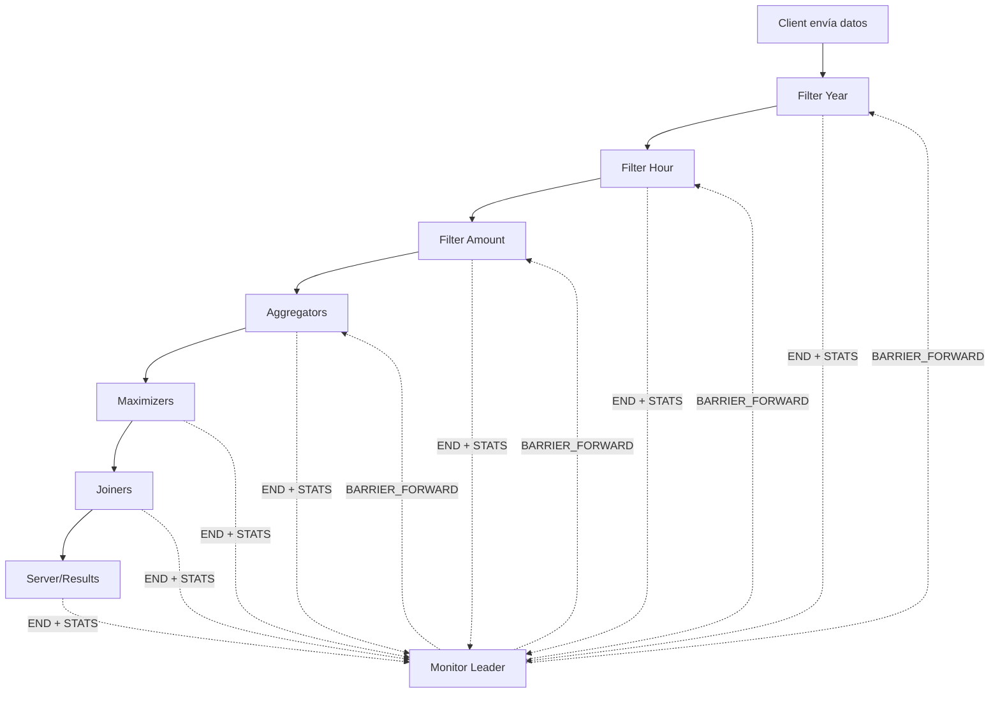
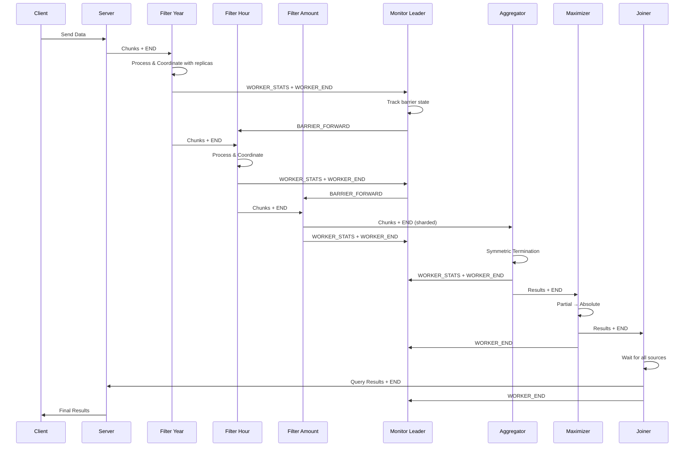

# Protocolo END - Sistema Distribuido

## Resumen Ejecutivo

Este documento explica cómo funciona el protocolo de finalización (END) en el pipeline de procesamiento distribuido y cómo se coordina con el monitor para garantizar una terminación correcta y sincronizada de todas las etapas.

## Arquitectura del Protocolo END

### Componentes Principales

1. **Workers**: Filters, Aggregators, Maximizers, Joiners
2. **Monitor**: Nodo central de coordinación (líder elegido mediante Bully Algorithm)
3. **RabbitMQ Exchanges**: 
   - `COORDINATION_EXCHANGE`: Coordinación de barreras END/STATS
   - Exchange específicos por worker: `end_exchange_filter_*`, `aggregator_stats_exchange_*`, etc.

### Flujo General



---

## Protocolo END por Worker

### 1. Filter (Year, Hour, Amount)

#### Recepción de END

El filter recibe mensajes END de la etapa anterior (o del servidor en el caso del primer filter):

```python
# Decodifica el mensaje END
end_message = MessageEnd.decode(msg)
client_id = end_message.client_id()
table_type = end_message.table_type()
total_expected = end_message.total_chunks()

# Marca END como recibido
self.working_state.end_received(client_id, table_type)
self.working_state.set_total_chunks_expected(client_id, table_type, total_expected)
```

#### Coordinación con Réplicas

Los filters utilizan un **protocolo de estadísticas compartidas** para coordinar la propagación del END entre réplicas:

1. **Envío de STATS propias**: Cada filter (id=1,2,3...) envía sus estadísticas propias vía exchange `end_exchange_filter_{type}`
2. **Recepción de STATS de peers**: Escucha las estadísticas de otros filters del mismo tipo
3. **Agregación de contadores**: Suma los chunks procesados de todos los filters
4. **Decisión de END**: Solo cuando `total_received >= total_expected`, el filter líder (id=1) envía END downstream

```python
# Envío de stats propias
if self.working_state.should_send_stats(client_id, table_type, own_received, own_not_sent):
    stats_msg = FilterStatsMessage(self.id, client_id, table_type, total_expected, own_received, own_not_sent)
    self.middleware_end_exchange.send(stats_msg.encode())
    
# Verificar si puede enviar END
if self.working_state.can_send_end_message(client_id, table_type, total_expected, self.id):
    self._send_end_message(client_id, table_type, total_expected, total_not_sent)
```

#### Envío de END Downstream

Cuando el filter determina que está listo, envía mensajes END:

1. **To Static Queues**: Cola estática hacia el siguiente filter
2. **To Sharded Queues**: Un END por cada shard de aggregator con el count específico de ese shard
3. **To Coordination Exchange**: Notifica al monitor sobre la finalización

```python
def _send_end_message(self, client_id, table_type, total_expected, total_not_sent):
    # 1. Static queues (siguiente filter)
    for queue_name, queue in self.middleware_queue_sender.items():
        msg_to_send = MessageEnd(client_id, table_type, total_expected - total_not_sent, str(self.id))
        queue.send(msg_to_send.encode())
    
    # 2. Dynamic shard queues (Aggregators)
    for i in range(1, self.products_shards + 1):
        queue_name = f"to_agg_products_shard_{i}"
        shard_total = self.shard_chunks_sent.get((STAGE_AGG_PRODUCTS, client_id, table_type, i), 0)
        msg_to_send = MessageEnd(client_id, table_type, shard_total, str(self.id))
        queue.send(msg_to_send.encode())
    
    # 3. Coordination exchange (Monitor)
    payload = {
        "type": MSG_WORKER_END,
        "id": str(self.id),
        "client_id": client_id,
        "stage": self.stage,  # e.g., STAGE_FILTER_YEAR
        "expected": total_expected,
        "chunks": total_expected - total_not_sent,
        "sender": str(self.id),
        "shard": self.shard_id,
    }
    rk = f"coordination.barrier.{self.stage}.shard.{self.shard_id}"
    self.middleware_coordination.send(json.dumps(payload).encode("utf-8"), routing_key=rk)
```

#### Comunicación con Monitor

**Mensajes enviados al Monitor**:

1. **MSG_WORKER_STATS**: Estadísticas de progreso
   - `expected`: Total de chunks esperados
   - `chunks`: Chunks procesados por este filter
   - `not_sent`: Chunks filtrados (no enviados downstream)

2. **MSG_WORKER_END**: Señal de finalización
   - Indica que este filter ha completado el procesamiento para un cliente

**Routing Key**: `coordination.barrier.{stage}.shard.{shard_id}`

Por ejemplo: `coordination.barrier.filter_year.shard.1`

---

### 2. Aggregator (Products, Purchases, TPV)

Los aggregators utilizan **Terminación Simétrica** - todos los aggregators de un tipo participan en igualdad para decidir cuándo enviar END.

#### Recepción de END

```python
def _handle_end_message(self, raw_msg: bytes):
    end_message = MessageEnd.decode(raw_msg)
    client_id = end_message.client_id()
    table_type = end_message.table_type()
    total_expected = end_message.total_chunks()
    
    # Marca END recibido y establece total global esperado
    self.working_state.mark_end_message_received(client_id, table_type)
    self.working_state.set_global_total_expected(client_id, table_type, total_expected)
    
    # Envía stats con el total esperado a otros aggregators
    self._maybe_send_stats(client_id, table_type, force=True)
```

#### Intercambio de Estadísticas entre Aggregators

Cada aggregator envía mensajes de estadísticas vía `aggregator_stats_exchange_{type}`:

```python
stats_msg = AggregatorStatsMessage(
    self.aggregator_id,     # ID de este aggregator
    client_id,
    table_type,
    total_expected,         # Total global conocido
    received,               # Chunks recibidos por este aggregator
    processed,              # Chunks procesados por este aggregator
)
self.middleware_stats_exchange.send(stats_msg.encode())
```

Los peers escuchan estos mensajes y actualizan su vista global:

```python
self.working_state.update_chunks_received(stats.client_id, stats.table_type, stats.aggregator_id, stats.chunks_received)
self.working_state.update_chunks_processed(stats.client_id, stats.table_type, stats.aggregator_id, stats.chunks_processed)
```

#### Condición de Terminación Simétrica

Cada aggregator decide independientemente si puede enviar END basándose en:

```python
def _can_send_end_message(self, client_id, table_type):
    # 1. Conocer el total global esperado
    global_total = self.working_state.get_global_total_expected(client_id, table_type)
    if global_total is None:
        return False
    
    # 2. Haber procesado todo lo recibido localmente
    received = self.working_state.get_received_for_aggregator(client_id, table_type, self.aggregator_id)
    processed = self.working_state.get_processed_for_aggregator(client_id, table_type, self.aggregator_id)
    if processed < received:
        return False
    
    # 3. Todos los peers han procesado su parte (vista global)
    total_processed_global = self.working_state.get_total_processed_global(client_id, table_type)
    if total_processed_global < global_total:
        return False
    
    # 4. Consistencia de acumulación
    total_accumulated = self.working_state.get_total_accumulated(client_id, table_type)
    if total_processed_global != total_accumulated:
        return False
    
    return True
```

#### Envío de END

Cuando la condición de terminación se cumple, **cada aggregator** envía su propio END:

```python
def _send_end_message(self, client_id, table_type):
    # Publicar resultados finales
    self.publish_final_results(client_id, table_type)
    
    # Enviar END con el count de chunks procesados por este aggregator
    my_processed = self.working_state.get_processed_for_aggregator(client_id, table_type, self.aggregator_id)
    end_msg = MessageEnd(client_id, table_type, my_processed, str(self.aggregator_id))
    
    for queue in self.middleware_queue_sender.values():
        queue.send(end_msg.encode())
    
    # Notificar al monitor
    payload = {
        "type": MSG_WORKER_END,
        "id": str(self.aggregator_id),
        "client_id": client_id,
        "stage": self.stage,  # e.g., STAGE_AGG_PRODUCTS
        "shard": self.shard_id or DEFAULT_SHARD,
        "expected": self.working_state.get_chunks_to_receive(client_id, table_type),
        "chunks": my_processed,
        "sender": str(self.aggregator_id),
    }
    rk = f"coordination.barrier.{self.stage}.{self.shard_id or DEFAULT_SHARD}"
    self.middleware_coordination.send(json.dumps(payload).encode("utf-8"), routing_key=rk)
```

---

### 3. Maximizer (Partials y Absolute)

Los maximizers manejan dos configuraciones:
- **Partial Maximizers**: Calculan máximos locales de un rango
- **Absolute Maximizer**: Calcula el máximo global de todos los partials

#### Partial Maximizer

Recibe END del aggregator:

```python
def _handle_end_message(self, raw_message: bytes):
    end_message = MessageEnd.decode(raw_message)
    client_id = end_message.client_id()
    table_type = end_message.table_type()
    sender_id = end_message.sender_id()
    count = end_message.total_chunks()
    
    # Registra END del aggregator
    self.working_state.partial_end_counts[client_id] += 1
    
    # Si recibió END de todos los aggregators esperados
    if self.working_state.partial_end_counts[client_id] >= self.expected_inputs:
        # Publica resultados parciales al absolute maximizer
        self.publish_partial_max_results(client_id)
        
        # Envía END al absolute
        chunks_sent = 1  # Generalmente 1 chunk de resultados
        self._send_end_message(client_id, TableType.TRANSACTION_ITEMS, "joiner", chunks_sent, sender_id)
```

#### Absolute Maximizer

No escucha del middleware_exchange_receiver (recibe solo de partials vía direct queue):

```python
# En __init__, si es absolute:
if self.is_absolute_max():
    self.middleware_exchange_receiver = None  # No escucha END de nadie upstream
```

Recibe END de cada partial maximizer, y cuando tiene todos:

```python
# Cuenta END messages de partials
if self.working_state.partial_end_counts[client_id] >= self.expected_inputs:
    # Publica resultados finales al joiner
    self.publish_absolute_max_results(client_id)
    
    # Envía END al joiner
    self._send_end_message(client_id, TableType.TRANSACTION_ITEMS, "joiner", chunks_sent, sender_id)
```

#### Formato de END

```python
def _send_end_message(self, client_id: int, table_type: TableType, target: str, count: int, sender_id: str):
    msg = MessageEnd(client_id, table_type, count, sender_id).encode()
    
    if target == "joiner":
        self.middleware_queue_sender["to_joiner"].send(msg)
    
    # Notificar al monitor
    payload = {
        "type": MSG_WORKER_END,
        "id": str(self.maximizer_range),
        "client_id": client_id,
        "stage": STAGE_MAX_ABSOLUTE if self.is_absolute_max() else STAGE_MAX_PARTIALS,
        "expected": count,
        "chunks": count,
        "sender": str(self.maximizer_range),
    }
    rk = f"coordination.barrier.{payload['stage']}.{DEFAULT_SHARD}"
    self.middleware_coordination.send(json.dumps(payload).encode("utf-8"), routing_key=rk)
```

---

### 4. Joiner (Items, Stores TPV, Stores Top3, Users)

Los joiners esperan END de múltiples fuentes:
1. **Main data**: Datos del maximizer/aggregator
2. **Join data**: Tabla auxiliar para el join (ej: productos, stores, usuarios)

#### Tracking de END Messages

```python
def _handle_barrier_forward(self, raw_msg: bytes):
    data = json.loads(raw_msg)
    if data.get("type") != MSG_BARRIER_FORWARD:
        return
    
    client_id = data.get("client_id")
    stage = data.get("stage")
    
    # Marca el sender como finished (normalmente "monitor")
    if stage == self.joiner_type:
        self.working_state_main.mark_sender_finished(client_id, "monitor")
        
        # Si está listo para procesar
        if self.is_ready_to_join_for_client(client_id):
            self.apply_for_client(client_id)
            self.send_end_query_msg(client_id)
```

#### Condición de Procesamiento

```python
def is_ready_to_join_for_client(self, client_id):
    # 1. Tiene todos los END esperados de main data
    finished_count = len(self.working_state_main.finished_senders.get(client_id, set()))
    if finished_count < self.expected_inputs:
        return False
    
    # 2. Tiene join data disponible
    if not self.working_state_join.join_data_ready:
        return False
    
    # 3. No ha sido procesado ya
    if self.working_state_main.client_processed.get(client_id, False):
        return False
    
    return True
```

#### Envío de END (Query Result)

Cada tipo de joiner implementa `send_end_query_msg`:

```python
# Ejemplo: MenuItemsJoiner
def send_end_query_msg(self, client_id):
    result_count = len(self.working_state_main.result_data.get(client_id, []))
    msg = MessageQueryEnd(client_id, ResultTableType.QUERY_3, result_count)
    self.middleware_queue_sender["to_server"].send(msg.encode())
    
    # Notificar al monitor
    payload = {
        "type": MSG_WORKER_END,
        "id": self.joiner_type,
        "client_id": client_id,
        "stage": self.stage,
        "expected": result_count,
        "chunks": result_count,
        "sender": self.joiner_type,
    }
    rk = f"coordination.barrier.{self.stage}.{DEFAULT_SHARD}"
    self.middleware_coordination.send(json.dumps(payload).encode("utf-8"), routing_key=rk)
```

---

## Monitor: Coordinación Central de Barreras

### Responsabilidades del Monitor Líder

El monitor líder coordina la terminación global mediante un **protocolo de barreras**:

1. **Recepción de mensajes**: Escucha `MSG_WORKER_STATS` y `MSG_WORKER_END` de todos los workers
2. **Tracking de estado**: Mantiene contadores por `(client_id, stage, shard)`
3. **Decisión de barrera**: Determina cuando una etapa ha completado
4. **Forward downstream**: Propaga `MSG_BARRIER_FORWARD` para desencadenar la siguiente etapa

### Estructura de Tracking

```python
self.barrier_state = defaultdict(lambda: defaultdict(lambda: defaultdict(lambda: {
    'expected': None,                # Workers esperados para esta etapa
    'received_end': 0,               # Cantidad de END recibidos
    'sender_ids': set(),             # IDs de workers que reportaron
    'end_sender_ids': set(),         # IDs de workers que enviaron END
    'total_chunks': 0,               # Total de chunks procesados
    'last_forward_ts': 0,            # Timestamp del último forward
    'forwarded': False,              # Si ya se hizo forward
    'stats_expected_chunks': None,   # Total esperado según stats
    'stats_received': 0,             # Chunks recibidos según stats
    'stats_processed': 0,            # Chunks procesados según stats
})))
```

### Manejo de Mensajes

```python
def _handle_barrier_message(self, data):
    client_id = data.get('client_id')
    stage = data.get('stage')
    shard = data.get('shard') or DEFAULT_SHARD
    sender = data.get('sender')
    chunks = data.get('chunks', 0)
    msg_type = data.get('type')
    
    tracker = self.barrier_state[client_id][stage][shard]
    
    if msg_type == MSG_WORKER_END:
        # Contar END solo una vez por sender
        if sender not in tracker['end_sender_ids']:
            tracker['received_end'] += 1
            tracker['end_sender_ids'].add(sender)
        tracker['total_chunks'] += chunks
        
    elif msg_type == MSG_WORKER_STATS:
        # Actualizar stats
        tracker['stats_expected_chunks'] = data.get('expected')
        tracker['stats_received'] = max(tracker.get('stats_received', 0), data.get('chunks', 0))
        tracker['stats_processed'] = max(tracker.get('stats_processed', 0), data.get('processed', 0))
```

### Decisión de Forward

El monitor verifica periódicamente (cada segundo) si puede hacer forward:

```python
def _forward_loop(self):
    while self.running:
        time.sleep(1)
        if not self.is_leader:
            continue
        
        now = time.time()
        for client_id, stages in list(self.barrier_state.items()):
            for stage, shards in list(stages.items()):
                for shard, tracker in list(shards.items()):
                    if tracker['forwarded']:
                        continue
                    
                    expected_workers = tracker['expected'] or self.stage_expected.get(stage)
                    
                    # Condiciones para forward:
                    # 1. Recibió END de todos los workers esperados
                    ends_ok = tracker['received_end'] >= expected_workers
                    
                    # 2. Las estadísticas confirman que se procesó todo lo esperado
                    stats_expected = tracker.get('stats_expected_chunks')
                    if stats_expected is None:
                        stats_ok = False
                    else:
                        stats_ok = max(tracker.get('stats_received', 0), tracker.get('stats_processed', 0)) >= stats_expected
                    
                    # 3. Ha pasado suficiente tiempo desde el último intento
                    if ends_ok and stats_ok:
                        if now - tracker['last_forward_ts'] >= self.forward_interval:
                            self._forward_barrier(client_id, stage, shard, tracker)
                            tracker['last_forward_ts'] = now
```

### Envío de BARRIER_FORWARD

```python
def _forward_barrier(self, client_id, stage, shard, tracker):
    msg = {
        'type': MSG_BARRIER_FORWARD,
        'client_id': client_id,
        'stage': stage,
        'shard': shard,
        'timestamp': time.time(),
        'total_chunks': tracker['total_chunks'],
        'senders': list(tracker['end_sender_ids']),
    }
    
    # Publicar al coordination exchange
    routing_key = f"coordination.barrier.{stage}.{shard}"
    channel.basic_publish(
        exchange=COORDINATION_EXCHANGE,
        routing_key=routing_key,
        body=json.dumps(msg)
    )
    
    tracker['forwarded'] = True
    logging.info(
        f"Barrier forward | client:{client_id} | stage:{stage} | shard:{shard} | "
        f"total_chunks:{tracker['total_chunks']} | ends:{tracker['received_end']}/{tracker.get('expected')}"
    )
```

---

## Configuración de Stages Esperados

El monitor carga la configuración de workers esperados desde `config.ini`:

```python
def _load_expected_from_config(self):
    # Mapeo de config keys a stage names
    stage_map = {
        "FILTER_YEAR": STAGE_FILTER_YEAR,
        "FILTER_HOUR": STAGE_FILTER_HOUR,
        "FILTER_AMOUNT": STAGE_FILTER_AMOUNT,
        "AGGREGATOR_PRODUCTS": STAGE_AGG_PRODUCTS,
        "AGGREGATOR_TPV": STAGE_AGG_TPV,
        "AGGREGATOR_PURCHASES": STAGE_AGG_PURCHASES,
        "MAXIMIZER_MAX_PARTIAL": STAGE_MAX_PARTIALS,
        "MAXIMIZER_MAX_ABSOLUTE": STAGE_MAX_ABSOLUTE,
        # ...
    }
    
    # Para stages sharded, se espera 1 worker por shard
    sharded_stages = {STAGE_AGG_PRODUCTS, STAGE_AGG_TPV, STAGE_AGG_PURCHASES, 
                      STAGE_FILTER_YEAR, STAGE_FILTER_HOUR, STAGE_FILTER_AMOUNT}
```

---

## Resumen del Flujo END Completo

1. **Client → Server → Filter Year**
   - Server envía chunks y finalmente END
   - Filter Year procesa, coordina con réplicas vía stats
   - Filter líder (id=1) decide cuando enviar END

2. **Filter Year → Monitor**
   - Envía `MSG_WORKER_STATS` periódicamente
   - Envía `MSG_WORKER_END` cuando termina
   - Monitor acumula hasta tener END de todos los filters year

3. **Monitor → Filter Hour** (via BARRIER_FORWARD)
   - Monitor verifica: `ends_ok && stats_ok`
   - Envía `BARRIER_FORWARD` a `coordination.barrier.filter_year.shard.{id}`
   - Filter Hour recibe forward y puede enviar su END downstream

4. **Aggregators** (Terminación Simétrica)
   - Reciben END de filters
   - Se comunican stats entre sí
   - Cada uno determina independientemente cuándo enviar END
   - Todos envían sus END cuando condición global se cumple

5. **Maximizers** (Jerarquía Partial → Absolute)
   - Partials reciben END de aggregators
   - Partials envían resultados + END a absolute
   - Absolute recibe END de todos partials
   - Absolute envía resultados + END a joiners

6. **Joiners** (Multi-source END)
   - Esperan END del maximizer Y datos de join (productos/stores/users)
   - Procesan cuando ambas fuentes están completas
   - Envían query results + END al server

7. **Server → Client**
   - Server recibe query results de joiners
   - Envía resultados finales al cliente
   - Cierra conexión

---

## Tolerancia a Fallos

### Deduplicación de Mensajes

- **Global Dedup (Filters)**: Archivo compartido `/data/persistence/filter_{type}_global_processed`
- **Working State Dedup**: Set de `processed_ids` en memoria
- **Idempotencia**: Verificación de `message_id` antes de procesar

### Recuperación de Estado

```python
# Persistencia de working state
self.persistence_service.commit_working_state(self.working_state.to_bytes(), message_id)

# Recuperación en inicio
last_processing_chunk = self.persistence_service.recover_last_processing_chunk()
```

### Monitor Failover

- **Elección de Líder**: Bully Algorithm
- **Heartbeat**: Cada 2s, timeout 20s
- **Revive de Workers**: `docker restart {container_name}`

---

## Constantes y Configuración

### Protocol Constants (`utils/protocol.py`)

```python
COORDINATION_EXCHANGE = 'coordination_exchange'
MSG_WORKER_END = 'WORKER_END'
MSG_WORKER_STATS = 'WORKER_STATS'
MSG_BARRIER_FORWARD = 'BARRIER_FORWARD'

STAGE_FILTER_YEAR = 'filter_year'
STAGE_FILTER_HOUR = 'filter_hour'
STAGE_FILTER_AMOUNT = 'filter_amount'
STAGE_AGG_PRODUCTS = 'agg_products'
STAGE_AGG_TPV = 'agg_tpv'
STAGE_AGG_PURCHASES = 'agg_purchases'
STAGE_MAX_PARTIALS = 'max_partials'
STAGE_MAX_ABSOLUTE = 'max_absolute'
STAGE_TOP3_PARTIALS = 'top3_partials'
STAGE_TOP3_ABSOLUTE = 'top3_absolute'
STAGE_JOIN_ITEMS = 'join_items'
STAGE_JOIN_STORES_TPV = 'join_stores_tpv'
STAGE_JOIN_STORES_TOP3 = 'join_stores_top3'
STAGE_JOIN_USERS = 'join_users'
STAGE_SERVER_RESULTS = 'server_results'
```

### Routing Keys

- **Worker → Monitor**: `coordination.barrier.{stage}.shard.{shard_id}`
- **Monitor → Worker**: `coordination.barrier.{stage}.{shard}`

Ejemplos:
- `coordination.barrier.filter_year.shard.1`
- `coordination.barrier.agg_products.shard.2`
- `coordination.barrier.max_absolute.global`

---

## Ventajas del Diseño

1. **Coordinación Centralizada**: El monitor provee una vista global, evitando deadlocks
2. **Terminación Simétrica (Aggregators)**: Todos participan equitativamente, mejor escalabilidad
3. **Idempotencia**: Reenvíos y crashes no causan duplicados
4. **Desacoplamiento**: Workers no conocen la topología completa, solo su etapa
5. **Observabilidad**: Monitor mantiene estado global para debugging y métricas

## Diagrama de Secuencia Completo



---

## Referencias

- [workers/filter/common/filter.py](file:///home/mgonzalezp/Documents/code/fiuba-distro-tp/workers/filter/common/filter.py#L345-L417) - Implementación Filter END
- [workers/aggregators/common/aggregator.py](file:///home/mgonzalezp/Documents/code/fiuba-distro-tp/workers/aggregators/common/aggregator.py#L655-L772) - Terminación Simétrica Aggregator
- [workers/maximizers/common/maximizer.py](file:///home/mgonzalezp/Documents/code/fiuba-distro-tp/workers/maximizers/common/maximizer.py#L338-L380) - Maximizer END
- [workers/joiners/common/joiner.py](file:///home/mgonzalezp/Documents/code/fiuba-distro-tp/workers/joiners/common/joiner.py#L329-L399) - Joiner Barrier Forward
- [monitor/common/monitor.py](file:///home/mgonzalezp/Documents/code/fiuba-distro-tp/monitor/common/monitor.py#L371-L429) - Monitor Barrier Logic
- [utils/protocol.py](file:///home/mgonzalezp/Documents/code/fiuba-distro-tp/utils/protocol.py) - Constantes de Protocolo
